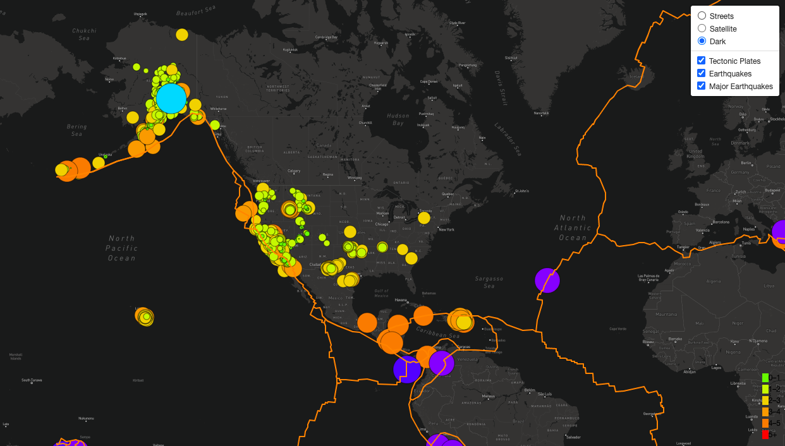

# Mapping Earthquakes

## Overview
The goal was to automate a web browser with earthquake data in relation to tectonic plates’ location on the earth. JavaScript's Leaflet library and Mapbox API were used to create visualizations of earthquake data from the U.S. Geological Survey. 

The Mapping Earthquakes local server was created to filter and display:
1. all existing earthquake data
2. major earthquakes with a magnitude greater than 4.5
3. tectonic plates locations

To complete this work the following were used:
* Javascript
* D3 libraries
* GeoJSON data
* Leaflet API
* Mapbox for map view options (streets, satellite and dark)
* HTML/CSS portfolio to showcase the data

